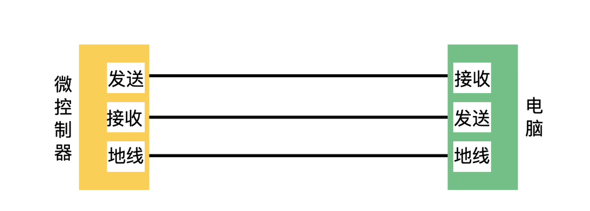
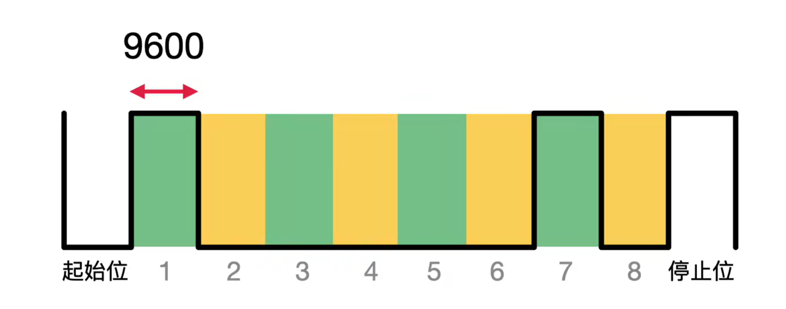
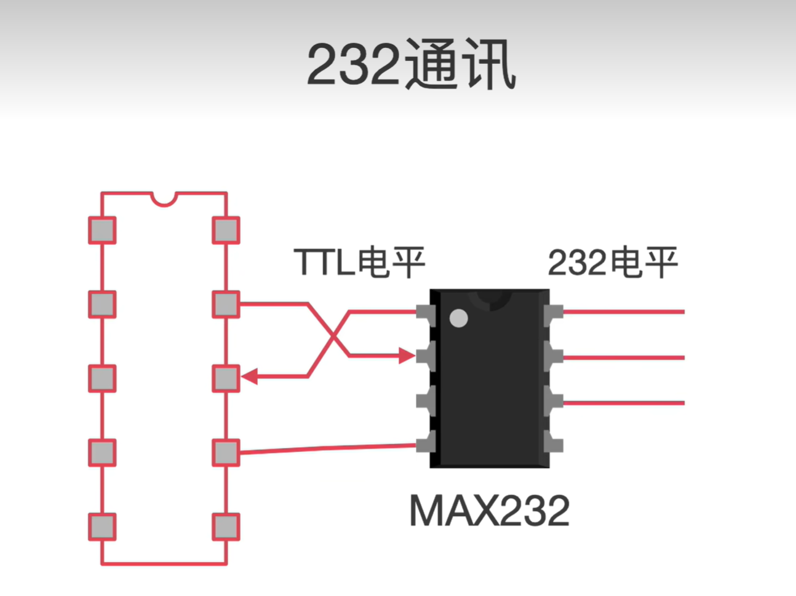
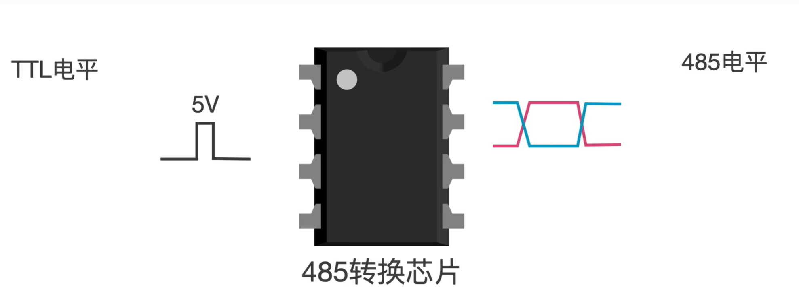
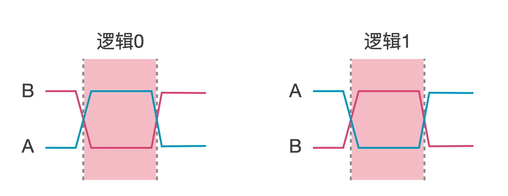

### 
通信原理
#### 1. 串口通信原理
串口通信的原理图如下图所示，一共需要**TX,RX,GND**三根线。

串口通信是一个字符一个字符的传输，每个字符一位一位的传输。一个字符一般为10位，1个起始位，8个数据位，1个停止位。在传输一组数据时，要加上帧头和帧尾。

串口波特率的意思是一秒内发送高低电平的个数，例如9600的波特率，一秒钟可以发送9600个高低电平。
串口通讯采用**TTL**逻辑，输出的高电平最小为2.4V，输出的高电平最大为0.4V。

缺点就是在受到静电干扰，很可能就把低电平变高，造成传输数据错误，因此他的传输距离比较短。因此就有了**RS232**(recommend standard 232)和**RS485**。
#### 2. RS232通信

**RS232**是通过一个芯片把TTL发送给他的5V电压转化成12V，把TTL发送给他的0V电压转化成-12V。同样他也把接收到的232电平转换成TTL电平。
#### 3.RS485通信

**RS485**通过把TTL电平信号转化成差分信号，差分信号通过两根信号的差值来表示逻辑0和逻辑1。

差分信号只需要两根线就可以进行数据传输，在传输过程中受到干扰时，两根线同时收到干扰，差值不变，抗干扰能力更强。
**串口通信**和**RS232**都是全双工通信，可以同时收发。
**RS485**是半双工通信，收和发只能单独进行，不能同时进行。
#### 4.CAN通信