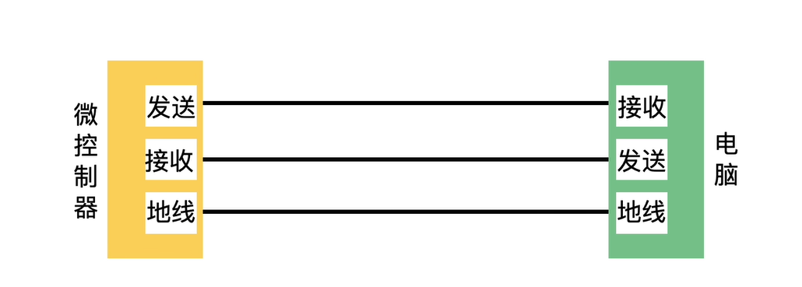
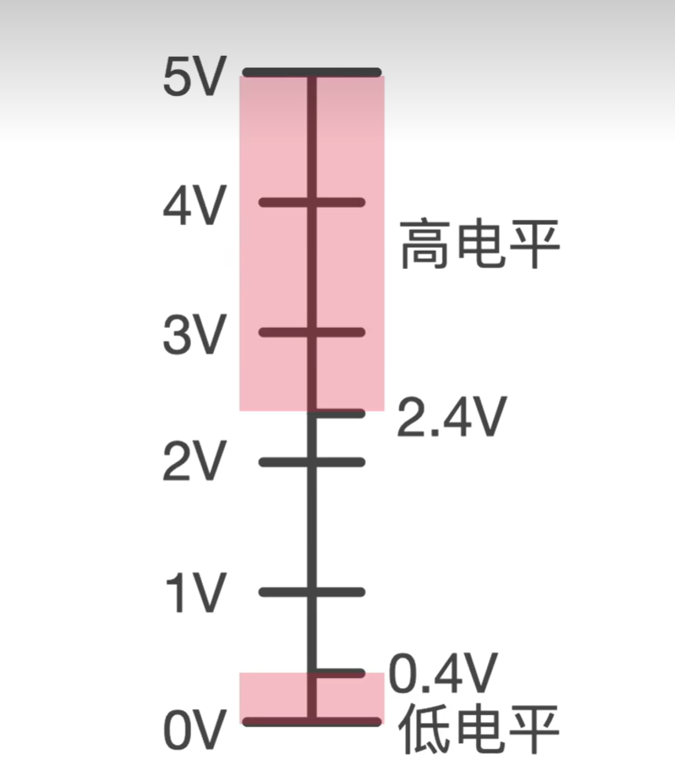
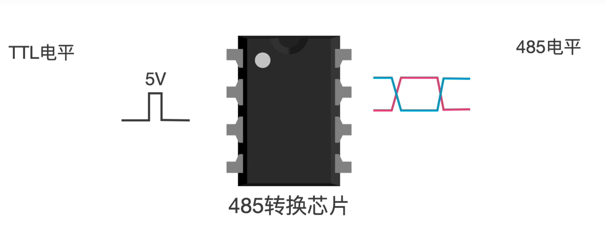
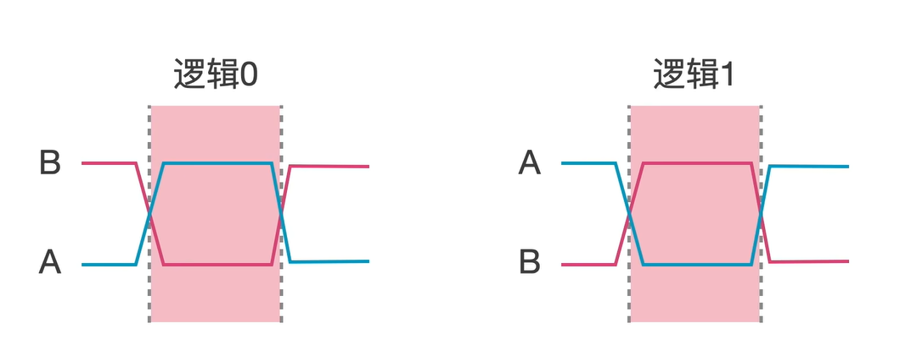

### 
通信原理
#### 1. 串口通信原理
串口通信的原理图如下图所示，一共需要**TX,RX,GND**三根线。

串口通信是一个字符一个字符的传输，每个字符一位一位的传输。一个字符一般为10位，1个起始位，8个数据位，1个停止位。在传输一组数据时，要加上帧头和帧尾。

串口波特率的意思是一秒内发送高低电平的个数，例如9600的波特率，一秒钟可以发送9600个高低电平。
串口通讯采用**TTL**逻辑，输出的高电平最小为2.4V，输出的高电平最大为0.4V。

缺点就是在受到静电干扰，很可能就把低电平变高，造成传输数据错误，因此他的传输距离比较短。因此就有了**RS232**(recommend standard 232)和**RS485**。
#### 2. RS232通信

**RS232**是通过一个芯片把TTL发送给他的5V电压转化成12V，把TTL发送给他的0V电压转化成-12V。同样他也把接收到的232电平转换成TTL电平。
#### 3.RS485通信

**RS485**通过把TTL电平信号转化成差分信号，差分信号通过两根信号的差值来表示逻辑0和逻辑1。

差分信号只需要两根线就可以进行数据传输，在传输过程中受到干扰时，两根线同时收到干扰，差值不变，抗干扰能力更强。
**串口通信**和**RS232**都是全双工通信，可以同时收发。
**RS485**是半双工通信，收和发只能单独进行，不能同时进行。
#### 4.CAN总线
控制器局域网总线（CAN，Controller Area Network）是一种用于实时应用的串行通讯协议总线，CAN节点通信路由结构

其中CAN收发器负责把TTL电平信号转换成差分信号，把差分信号转化成TTL电平信号。CAN控制器用于生成CAN帧并以二进制方式发送，在此过程中进行位填充、添加CRC校验、应答检测等操作；将接收到的二进制码进行解析并接收，在此过程中进行收发比对、去位填充、执行CRC校验等操作。通过配置CAN控制器中的寄存器，对配置总线时序，CAN模式，ID等等。一帧标准的数据帧如下图所示

参考连接
[1.CAN总线讲解](https://www.bilibili.com/video/BV14k4y187e6/?spm_id_from=333.337.search-card.all.click&vd_source=07cad1d165fcbc7ff2560176492487cd)
[2.CAN总线组成](https://blog.csdn.net/weixin_64064747/article/details/128074882)
[3.CAN寄存器配置](https://blog.csdn.net/geek_liyang/article/details/79467643)
